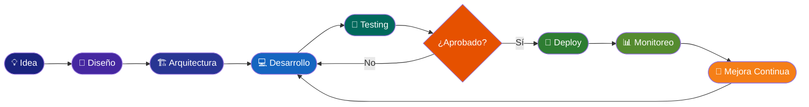
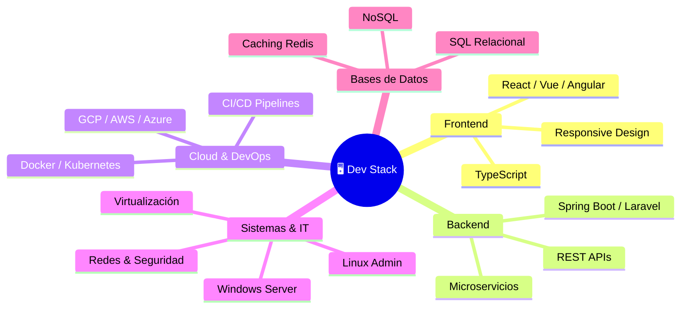

<div align="center">

<!-- Animated Header Banner -->


<!-- Dynamic Typing Effect -->
[](https://git.io/typing-svg)

<p align="center">
  <a href="https://linkedin.com/in/tu-perfil">
    
  </a>
  <a href="mailto:tu@email.com">
    
  </a>
  <a href="https://tu-portfolio.com">
    
  </a>
  
</p>

</div>

---

## 🧠 Sobre mí

```yaml
nombre:         "Analista Desarrollador"
ubicación:      "Colombia 🇨🇴"
experiencia:    "+ 3 años en desarrollo de software"
roles:          ["Full Stack Developer", "Cloud Engineer", "Sysadmin", "IT Specialist"]
enfoque:        ["Soluciones escalables", "Código limpio", "UX/UI", "Arquitectura de software"]
actualmente:    ["Automatización empresarial", "Plataforma de inventarios"]
aprendiendo:    ["Angular", "Spring Security", "Spring Cloud", "Kubernetes avanzado"]
disponibilidad: "Abierto a proyectos desafiantes 🚀"
```


- 🔭 **+3 años** construyendo software de alto impacto
- 💡 Especializado en **Frontend, Backend, Cloud y Sistemas**
- 🖥️ Experiencia en administración de **servidores Linux/Windows**
- 🔐 Conocimiento en **ciberseguridad básica y redes**
- 🛠️ Manejo de **ofimática avanzada y soporte IT**
- 📐 Apasionado por **arquitecturas limpias y escalables**
- 🤝 Trabajo en equipo bajo metodologías **Scrum y Agile**
- ✍️ Escritor de código **mantenible, testeable y documentado**

---

## 🚀 Stack Tecnológico

### 🖥️ Frontend


### ⚙️ Backend


### 🗄️ Bases de Datos


### ☁️ Cloud, DevOps & Servidores


### 🖥️ Sistemas Operativos & Servidores


### 🛡️ Redes & Seguridad


### 📊 Ofimática & Productividad


### 🧪 Testing & Calidad


### 🔧 Control de Versiones & IDEs


---

## 🔄 Flujo de Trabajo



---

## 🏗️ Arquitectura que manejo



---

## 📊 Estadísticas de GitHub

<div align="center">


</div>

---

## 🏆 Logros & Trofeos

<div align="center">
  
</div>

---

## 🌟 Actualmente trabajando en

<div align="center">

| 🔧 Proyecto | 📋 Descripción | 🛠️ Stack |
|---|---|---|
| **Sistema de Inventarios** | Plataforma empresarial escalable con módulos de gestión | Laravel · Vue · MySQL · Docker |
| **Automatización** | Actualización de sistemas de automatización con CI/CD | Python · Jenkins · GCP · Kubernetes |
| **Arquitectura Cloud** | Migración y optimización de servicios a la nube | GKE · GCE · Terraform · Grafana |

</div>

---

## 📚 Áreas de conocimiento

<div align="center">

| 💻 Desarrollo | 🖥️ Sistemas & IT | ☁️ Cloud | 🛡️ Seguridad |
|---|---|---|---|
| Full Stack Web | Linux / Windows Server | Google Cloud Platform | Gestión de firewalls |
| Microservicios | Administración de redes | AWS / Azure | VPN / SSH |
| APIs REST/GraphQL | Virtualización (VMware) | Kubernetes / Docker | Hardening de servidores |
| TDD / DDD / Scrum | Active Directory | CI/CD Pipelines | Monitoreo y alertas |
| Diseño de BD | Soporte Técnico IT | IaC con Terraform | Backup y recuperación |

</div>

---

## 🎯 Certificaciones & Metodologías

<div align="center">


</div>

---

## 📈 Actividad Reciente

<div align="center">
  
</div>

---

<div align="center">

### 💬 "El buen código es su propia mejor documentación." — Steve McConnell


</div>
