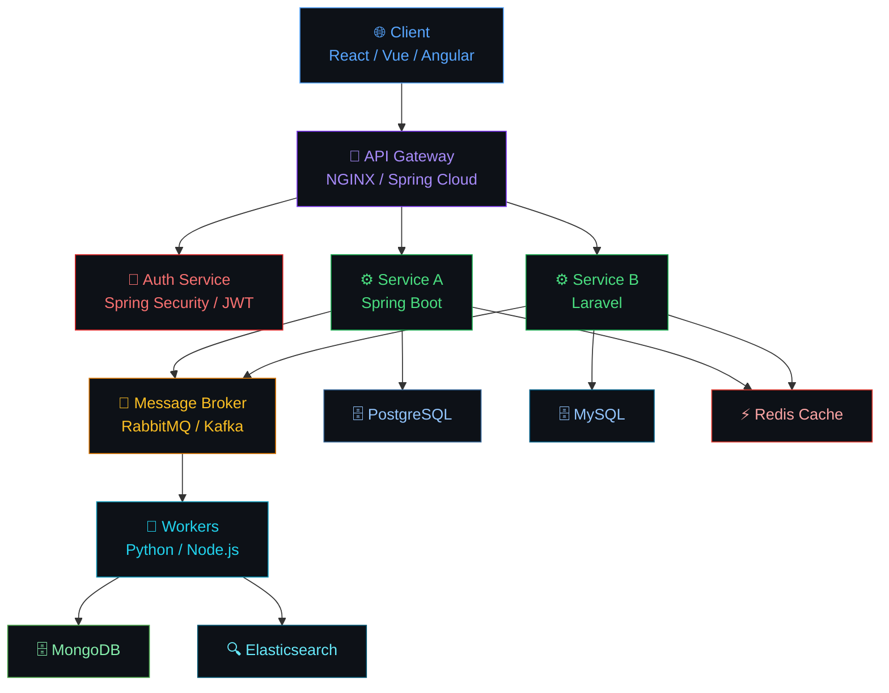

<div align="center">

<!-- Animated Header Banner -->


<!-- Dynamic Typing Effect -->
[](https://git.io/typing-svg)

<p align="center">
  <a href="https://linkedin.com/in/tu-perfil">
    
  </a>
  <a href="mailto:tu@email.com">
    
  </a>
  <a href="https://tu-portfolio.com">
    
  </a>
  
</p>

</div>

---

## 〈 About Me 〉

```typescript
const developer = {
  name:        "David Aceros",
  location:    "Colombia 🇨🇴",
  experience:  "+3 years building production software",
  focus:       ["Backend Engineering", "Full Stack Development", "Cloud & DevOps"],
  architecture:["Microservices", "REST APIs", "Event-Driven", "Clean Architecture"],
  currently:   ["Enterprise inventory platform", "CI/CD automation pipelines"],
  learning:    ["Spring Cloud", "Spring Security", "Advanced Kubernetes"],
  principles:  ["SOLID", "DRY", "TDD", "Domain-Driven Design"],
  open_to:     "Challenging projects & remote opportunities 🚀"
};
```


- 🔭 **+3 años** construyendo software escalable y de alto impacto
- ⚙️ Especializado en **Backend con Java/Spring Boot y PHP/Laravel**
- 🌐 Experiencia **Full Stack** con React, Vue.js y TypeScript
- ☁️ Diseño e implementación de **pipelines CI/CD y arquitecturas cloud**
- 🐳 Containerización con **Docker & Kubernetes** en producción
- 🧪 Defensor del **testing automatizado** y código limpio
- 📐 Apasionado por **arquitecturas limpias, escalables y mantenibles**
- 🤝 Metodologías **Scrum / Agile** en equipos multidisciplinarios

<br clear="right"/>

---

## 〈 Tech Stack 〉

### ⚡ Backend


### 🎨 Frontend


### 🗄️ Databases


### ☁️ Cloud & DevOps


### 🧪 Testing & Quality


### 🛠️ Tools & Version Control


---

## 〈 Development Flow 〉

```mermaid
flowchart LR
    A(["💡 Requirements"]) --> B(["🎨 Design & Architecture"])
    B --> C(["🔀 Feature Branch"])
    C --> D(["💻 Development TDD"])
    D --> E(["🧪 Unit & Integration Tests"])
    E --> F{"All Tests Pass?"}
    F -- Fail --> D
    F -- Pass --> G(["🔁 Code Review / PR"])
    G --> H(["🚀 CI/CD Pipeline"])
    H --> I(["🐳 Docker Build"])
    I --> J(["☁️ Deploy to Cloud"])
    J --> K(["📊 Monitoring & Alerting"])
    K --> L(["♻️ Continuous Improvement"])
    L --> C

    style A fill:#0d1117,stroke:#58a6ff,color:#58a6ff
    style B fill:#0d1117,stroke:#7c3aed,color:#a78bfa
    style C fill:#0d1117,stroke:#0ea5e9,color:#38bdf8
    style D fill:#0d1117,stroke:#2563eb,color:#60a5fa
    style E fill:#0d1117,stroke:#16a34a,color:#4ade80
    style F fill:#0d1117,stroke:#d97706,color:#fbbf24
    style G fill:#0d1117,stroke:#db2777,color:#f472b6
    style H fill:#0d1117,stroke:#2563eb,color:#60a5fa
    style I fill:#0d1117,stroke:#0891b2,color:#22d3ee
    style J fill:#0d1117,stroke:#16a34a,color:#4ade80
    style K fill:#0d1117,stroke:#ea580c,color:#fb923c
    style L fill:#0d1117,stroke:#9333ea,color:#c084fc
```



---

## 〈 Architecture I Work With 〉



---

## 〈 GitHub Stats 〉

<div align="center">


</div>

---

## 〈 Contribution Activity 〉

<div align="center">
  
</div>

---

## 〈 Trophies 〉

<div align="center">
  
</div>

---

## 〈 Active Projects 〉

<div align="center">

| Project | Description | Stack |
|:---:|---|:---:|
| 🏭 **Enterprise Inventory Platform** | Scalable multi-module management system with real-time stock tracking | `Laravel` `Vue.js` `MySQL` `Docker` |
| ⚙️ **CI/CD Automation Pipeline** | Automated build/test/deploy pipeline with rollback strategy | `Python` `Jenkins` `GCP` `Kubernetes` |
| ☁️ **Cloud Migration & Optimization** | Lift-and-shift + re-architecture of legacy services to GKE | `GKE` `Terraform` `Grafana` `Spring Boot` |

</div>

---

## 〈 Core Competencies 〉

<div align="center">

| 💻 Backend Dev | 🌐 Frontend Dev | ☁️ Cloud & DevOps | 🧪 Quality |
|---|---|---|---|
| REST & GraphQL APIs | React / Vue / Angular | Docker & Kubernetes | TDD & Unit Testing |
| Microservices | TypeScript / JavaScript | CI/CD Pipelines | Integration Tests |
| Spring Boot / Laravel | Component Architecture | GCP / AWS / Azure | SonarQube Analysis |
| Domain-Driven Design | State Management | Infrastructure as Code | API Testing (Postman) |
| Event-Driven Architecture | Responsive UI / UX | Monitoring & Alerts | Code Reviews |

</div>

---

## 〈 Engineering Principles 〉

<div align="center">


</div>

---

<div align="center">

### 〈 Let's Build Something Great Together 〉

*"Any fool can write code that a computer can understand. Good programmers write code that humans can understand."*
**— Martin Fowler**

<br/>

<a href="https://linkedin.com/in/tu-perfil">
  
</a>
&nbsp;
<a href="mailto:tu@email.com">
  
</a>

<br/><br/>


</div>
